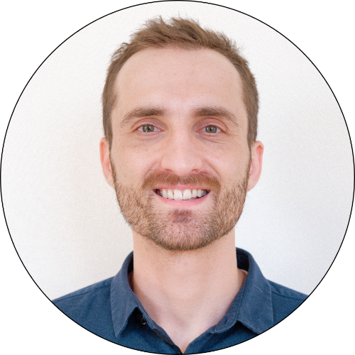

.. _Top:

About Me
========

Who are you?
------------

My name is Michael Sieler. I earned my Ph.D. in Microbiology from Oregon State University in 2025. I am a postdoctoral researcher in the `Liberti Lab <https://genev.unige.ch/research/laboratory/joanito-liberti>`_ in the Department of Genetics and Evolution at the University of Geneva in Switzerland.

What is your background?
------------------------

I received my bachelor's degree in Bioresource Research with options in Bioinformatics and Genomics from Oregon State University.

Throughout my undergraduate studies I conducted research alongside Ph.D. students and post-docs as well as independently. These experiences catalyzed my interest in studying the gut microbiome, and led me to join the `Sharpton Lab <http://lab.sharpton.org>`_ for graduate school, where I completed my dissertation on how environmental stressors shape zebrafish gut microbiome responses.

What do you do now?
-------------------

I am a postdoctoral researcher in the `Liberti Lab <https://genev.unige.ch/research/laboratory/joanito-liberti>`_ in the Department of Genetics and Evolution at the University of Geneva. My work focuses on the social microbiome and gut microbiota–brain axis of eusocial bees, building on my graduate training in multi-omic microbiome data science, longitudinal analysis, and host–microbiome ecology.

I continue to apply computational and statistical approaches to complex biological datasets, collaborate across international teams, and contribute to teaching and mentorship in microbiome analysis.

What do you want to do next?
----------------------------

In my current role I aim to deepen our understanding of how social behavior, development, and ecology shape microbial transmission and host–microbiota interactions in eusocial insects, while expanding my expertise in integrative multi-omic and reproducible data workflows.

What is this site for?
----------------------

The goal of this site is to provide a central location to share my `research and work experience <Experience/experience.html>`_.

How can I contact you?
----------------------

The best way to reach me is by `email <mailto:Michael.SielerJr@UniGe.ch>`_ .

**You can also find me here:**

- `LinkedIn <https://www.linkedin.com/in/mjsielerjr/>`_
- `GitHub <https://github.com/sielerjm>`_
- `Google Scholar <https://scholar.google.com/citations?user=XqblXigAAAAJ>`_

------

Return to `top`_.

------
