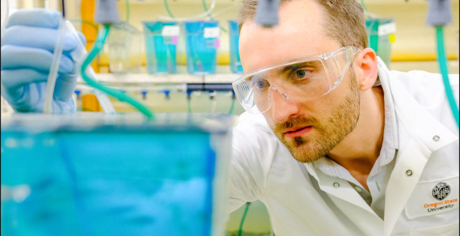

.. _Top:

Experience
==========

   

Summary
-------

* Microbiome scientist with 5+ years of experience developing and applying high-throughput molecular, computational, and statistical research methods to analyze 1000's of zebrafish gut microbiome samples
* Robust data analytic skills in multi-omic microbiome bioinformatics and multivariate statistics 
* Demonstrated abilities to collaborate and take leadership in cross-laboratory experiments and extra-curricular projects
* Experienced in written, oral and visual communication across scientific and public audiences

Education
---------

.. list-table::
   :widths: 80 20

   * - **Oregon State University**

       - **Ph.D. Microbiology**
       - Dissertation: `Defining the context dependence of how the zebrafish (Danio rerio) gut microbiome responds to environmental stressors <https://ir.library.oregonstate.edu/concern/graduate_thesis_or_dissertations/d217r0126?locale=en>`_ :download:`PDF <../Media/publications/SielerJrMichaelJ2025.pdf>`
       - Advised by `Dr. Thomas J. Sharpton <https://bit.ly/3cJfQ1b>`_
     - 2025

   * - **Oregon State University**

       - **B.Sc. Bioresource Research**, options in Bioinformatics and Genomics
     - 2020

Research
--------

.. list-table::
   :widths: 80 20

   * - **Oregon State University** - Research Associate
   
       - Department of Microbiology, Oregon State University. Corvallis, OR.
       - Dr. Thomas J. Sharpton
     - 2025-Present

   * - **Oregon State University** - Graduate Researcher
   
       - Department of Microbiology, Oregon State University. Corvallis, OR.
       - Advised by Dr. Thomas J. Sharpton
     - 2020-2025

   * - **Pacific Northwest National Laboratory** - PhD Intern

       - Richland, WA.
     - 2023

   * - **Oregon State University** - Undergraduate Researcher
   
       - Department of Microbiology, Oregon State University. Corvallis, OR.
       - Advised by Dr. Thomas J. Sharpton
     - 2018-2020

   * - **Oregon State University** - Undergraduate Researcher
   
       - College of Pharmacy, Oregon State University. Corvallis, OR.
       - Advised by Dr. Taifo Mahmud
     - 2017-2018

Work
----

.. list-table::
   :widths: 80 20

   * - **Research Associate**

       - **Sharpton Lab, Oregon State University**
         - Microbiome data science research
     - 2025-Present

   * - **Microbiome Data Analytics Boot Camp – Trainer**

       - **Skills for Health and Research Professionals (SHARP), Columbia University**
         - "Planning, generating, and analyzing 16S rRNA gene sequencing surveys"
         - Supported workshop participants in microbiome data analysis
     - 2025

   * - **National Microbiome Data Collaborative - Ambassador**

       - The NMDC ambassador program recognizes and fosters early career scientists' efforts to incorporate inclusion,
         diversity, equity, and accountability (IDEA) principles to promote findable, accessible, interoperable, and reusable (FAIR) microbiome research data and workflows.
     - 2024

   * - **Pacific Northwest National Laboratory - PhD Bioinformatics Intern**

       - **Projects:**
         - Batch effect correction algorithm (BECA) evaluation
           - Analyzed dilution series experiment to resolve batch effects in lipidomics datasets, evaluated 12 commonly used BECA methods, and developed a novel BECA evaluation model.

       - **Tools used:**
         - R
     - 2023

   * - **MJSieler Consulting - Owner**

       - **Projects:**
         - `Virtual Fish (GitHub) <https://github.com/OSU-Edu-Games/Virtual-Fish>`_
           - Designed, developed, and deployed educational video game software for clients
           - Educational software used to fulfill grant requirements for communicating scientific research.

       - **Tools used:**
         - C#, Unity, Git
     - May 2022-Present

Awards, Honors & Fellowships
----------------------------

.. list-table::
   :widths: 80 20

   * - **OSU Scholarly Presentation Award**

       - **Competitive Funding Recipient**
       - Awarded competitive funding to support graduate students presenting their research at professional conferences.
     - 2024

       *$600*

   * - **Oregon Department of Fish and Wildlife Fish Health Graduate Research Fellowship**

       - **Fish Health Graduate Research Fellow**
       - Recognized for research in Microbiology at Oregon State University, focusing on fish health issues to benefit Oregon's fish populations.
     - 2023-2025

       *$56,000*

   * - **NMDC Ambassador**

       - **Ambassador**
       - Recognized for early career efforts to advance microbiome bioinformatic research, and received training to promote the use of F.A.I.R. data principles in microbiome research.
     - 2024

       *$1,000*

   * - `Oregon Museum of Science and Industry <https://omsi.edu/science-communication-services>`_

       - **Science Communication Fellow**
       - Received certified training in informal science education and engagement with public audiences to increase their understanding of STEM research.
     - 2020-Present

       *$1,000*

   * - `ARCS Foundation <https://oregon.arcsfoundation.org>`_

       - **ARCS Scholar**
       - Recognized for my early significant contributions to scientific research, I was awarded the prestigious ARCS Scholar grant.
     - 2020-2023

       *$18,000*

Professional Affiliations and Service
-------------------------------------

.. list-table::
   :widths: 80 20

   * - **Leidholdt Microbiology Summer Camp** - Camp Mentor	
       - Department of Microbiology, Oregon State University. Corvallis, OR.
       - Supervised 20 high school students from historically underrepresented backgrounds in learning laboratory techniques.
     - 2022, 2024

   * - **Food and Nutrition Special Interest Group** - Advocate
       - Oregon Public Health Association. Portland, OR.
     - 2023-Present

   * - **Microbes and Social Equity Working Group** - Member
     - 2022-Present

   * - **Microbiology Graduate Student Association** - President
       - Oregon State University. Corvallis, OR.
     - 2022-2023

Certificates
------------

.. list-table::
   :widths: 80 20

   * - **Data Science and Machine Learning Bootcamp with R**
   
        - Program with R to wrangle, clean, analyze, and visualize data.
        - Apply advanced statistics and machine learning to gain useful insights.
        - `Certificate <https://www.udemy.com/certificate/UC-3bd3e63b-0450-4a37-8ffe-f92a920522f1/>`_
     - 2021

.. _Skills:

Skills
------

.. list-table::
   :widths: 33 33 33

   * - **Programming:**

        - R
        - Python
        - C# (Unity)
        - Git
        - HTML & CSS
        - C++
        - UNIX/Linux
     - **Statistics and Data Analytics:**

        - Multivariate regression
        - Model building and testing
        - Data visualization
          - ggplot2
          - R shiny
          - Plotly
     - **Bioinformatics:**

        - 16S sequencing
        - Metabolomics
        - Metatranscriptomics
        - DADA2
        - Phyloseq
        - Mothur
        - Sina
        - HMMER
        - FastTree
   * - **Laboratory:**

        - Zebrafish husbandry
           - Germ-free derivation
        - Bacterial culturing
        - DNA extraction
        - PCR amplification
        - Gel electrophoresis
     - **Other:**

        - Microsoft Office Suite
        - Adobe Photoshop and Illustrator
     - **Languages:**

        - English (native)
        - German (B2, intermediate)
        - Spanish (beginner)

Download Resume & CV
--------------------

:download:`Resume (one page) <../ResumeCV/MichaelSieler_Resume.pdf>`

:download:`CV <../ResumeCV/MichaelSieler_CV.pdf>`

------

Return to `top`_.

------
