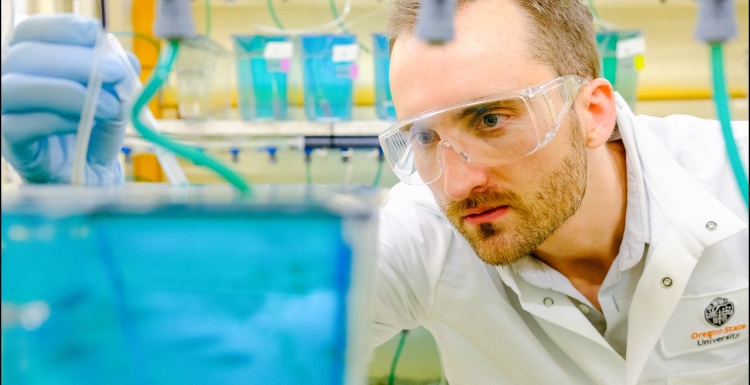

.. _Top:

Experience
==========

**Michael J. Sieler Jr., Ph.D.**

Postdoctoral Researcher, `Liberti Lab <https://genev.unige.ch/research/laboratory/joanito-liberti>`_

Department of Genetics and Evolution, University of Geneva

Geneva, Switzerland

`Michael.SielerJr@UniGe.ch <mailto:Michael.SielerJr@UniGe.ch>`_ | `MichaelSieler.com <https://michaelsieler.com>`_ | `GitHub <https://github.com/sielerjm>`_ | `LinkedIn <https://www.linkedin.com/in/mjsielerjr/>`_

   

Summary
-------

- Data scientist with 8+ years of experience developing and applying computational, statistical, and experimental approaches to complex biological datasets
- Expertise in multivariate modeling, longitudinal data analysis, multi-omic integration, reproducible workflows, and FAIR data practices
- Proven collaborator across international, interdisciplinary, and cross-functional teams, with a strong record of translating complex data into actionable scientific insights through publications, workshops, and collaborative research support
- Experienced in written, oral and visual communication across scientific and public audiences

Education
---------

.. list-table::
   :widths: 80 20

   * - **Oregon State University**, Corvallis, OR

       - **Ph.D. Microbiology** (GPA: 3.95)
       - Dissertation: `Defining the context dependence of how the zebrafish (Danio rerio) gut microbiome responds to environmental stressors <https://ir.library.oregonstate.edu/concern/graduate_thesis_or_dissertations/d217r0126?locale=en>`_ :download:`PDF <../Media/publications/SielerJrMichaelJ2025.pdf>`
       - Advised by `Dr. Thomas J. Sharpton <https://bit.ly/3cJfQ1b>`_
     - Sept 2025

   * - **Oregon State University**, Corvallis, OR

       - **B.Sc. Bioresource Research**, options in Bioinformatics and Genomics (GPA: 3.82)
     - June 2020

Research Appointments
---------------------

.. list-table::
   :widths: 80 20

   * - **University of Geneva** — Postdoctoral Researcher

       - `Liberti Lab <https://genev.unige.ch/research/laboratory/joanito-liberti>`_, Department of Genetics and Evolution. Geneva, Switzerland.
       - Research focus in gut microbiota–brain axis of eusocial bee model systems
       - See in-prep bumblebee microbiome work on the `Publications <../Publications/publications.html>`_ page
     - 2026–Present

   * - **Oregon State University** — Postdoctoral Researcher

       - Department of Microbiology, Oregon State University. Corvallis, OR.
       - `Sharpton Lab <http://lab.sharpton.org>`_ — microbiome data science
     - 2025

   * - **Oregon State University** — Ph.D. Graduate Student Researcher

       - Department of Microbiology, Oregon State University. Corvallis, OR.
       - Advised by Dr. Thomas J. Sharpton
       - Research focus in host-associated microbiome stability to environmental stressors
     - 2020–2025

   * - **Pacific Northwest National Laboratory** — Ph.D. Intern

       - Richland, WA.
       - Mentors: Lisa Bramer and Kelly Stratton
       - Research focus in metabolomic data science and bioinformatics
     - 2023–2024

   * - **Oregon State University** — Undergraduate Student Researcher
   
       - Department of Microbiology, Oregon State University. Corvallis, OR.
       - Advised by Dr. Thomas J. Sharpton
       - Research focus in zebrafish microbiome ecology and bioinformatics
     - 2018–2020

   * - **Oregon State University** — Undergraduate Student Researcher
   
       - Department of Pharmacy, Oregon State University. Corvallis, OR.
       - Advised by Dr. Taifo Mahmud
       - Research focus in identifying novel antibiotic compounds
     - 2017–2018

Work
----

.. list-table::
   :widths: 80 20

   * - **HandshakeAI** — Expert Biology AI Data Labeler

       - Contributed biological domain expertise to development of 100+ LLM prompts and evaluation tasks for scientific AI applications
       - Improved biological accuracy, consistency, and scientific reasoning in AI-generated outputs through expert review and feedback
     - 2025

   * - **Microbiome Data Analytics Boot Camp** — Trainer

       - **Skills for Health and Research Professionals (SHARP), Columbia University**
         - "Planning, generating, and analyzing 16S rRNA gene sequencing surveys"
         - Supported workshop participants and lecturers in microbiome data analysis and pedagogy
     - 2025

   * - **National Microbiome Data Collaborative** — FAIR Microbiome Data Fellow

       - Recognized for early career contributions promoting findable, accessible, interoperable, and reusable (FAIR) microbiome research data and workflows
       - Led workshops on metadata standards and submission portals; trained researchers in reproducible microbiome research workflows
     - 2024–2025

   * - **Pacific Northwest National Laboratory** — Ph.D. Bioinformatics Intern

       - **Projects:**
         - Batch effect correction algorithm (BECA) evaluation
           - Bioinformatically processed and analyzed 200+ lipidomic samples; evaluated 12 commonly used BECA methods using ground truth from a designed experiment

       - **Tools used:**
         - R
     - 2023–2024

Teaching
--------

.. list-table::
   :widths: 80 20

   * - **University of Geneva** — Postdoctoral Fellow, Co-instructor

       - Microbiome Analysis (co-instructor)
     - 2026

   * - **Oregon State University** — Graduate Teaching Assistant

       - General Microbiology Lab (MB 303, Spring)
       - Human Microbiome (MB 436, Spring)
       - Introduction to Microbiology (MB 230, Spring)
     - 2021–2023

Mentorship
----------

.. list-table::
   :widths: 80 20

   * - **University of Geneva**

       - Genetics and Evolution Ph.D. and master's students
     - 2026–Present

   * - **Oregon State University**

       - Microbiology Ph.D. and undergraduate students
     - 2023–2025

Peer Review
-----------

.. list-table::
   :widths: 80 20

   * - Hansson, B. *et al.* (2026). "Microbial signaling coordinates group oviposition and predator defense in migratory locusts"

Awards, Honors & Fellowships
----------------------------

.. list-table::
   :widths: 80 20

   * - **OSU Scholarly Presentation Award**

       - **Competitive Funding Recipient**
       - Awarded competitive funding to support graduate students presenting their research at professional conferences.
     - 2024

       *$600*

   * - **Oregon Department of Fish and Wildlife Fish Health Graduate Research Fellowship**

       - **Fish Health Graduate Research Fellow**
       - Recognized for research in Microbiology at Oregon State University, focusing on fish health issues to benefit Oregon's fish populations.
     - 2023–2025

       *$56,000*

   * - **NMDC Ambassador**

       - **Ambassador**
       - Recognized for early career contributions promoting findable, accessible, interoperable, and reusable (FAIR) microbiome research data and workflows; led workshops on metadata standards and submission portals.
     - 2024–2025

       *$1,000*

   * - `Oregon Museum of Science and Industry <https://omsi.edu/science-communication-services>`_

       - **Science Communication Fellow**
       - Received certified training in informal science education and engagement with public audiences to increase their understanding of STEM research.
     - 2020–2022

       *$1,000*

   * - `ARCS Foundation <https://oregon.arcsfoundation.org>`_

       - **ARCS Scholar**
       - Recognized for early significant contributions to scientific research.
     - 2020–2023

       *$18,000*

Professional Affiliations and Service
-------------------------------------

.. list-table::
   :widths: 80 20

   * - **Leidholdt Microbiology Summer Camp** — Camp Mentor	
       - Department of Microbiology, Oregon State University. Corvallis, OR.
       - Supervised 20 high school students from historically underrepresented backgrounds in learning laboratory techniques.
     - 2022, 2024, 2025

   * - **Food and Nutrition Special Interest Section** — Founding Section Member
       - Oregon Public Health Association. Portland, OR.
     - 2023–2025

   * - **Microbes and Social Equity Working Group** — Member
     - 2022–Present

   * - **Microbiology Graduate Student Association** — President
       - Oregon State University. Corvallis, OR.
     - 2022–2023

Certificates
------------

.. list-table::
   :widths: 80 20

   * - **Data Science and Machine Learning Bootcamp with R**
   
        - Program with R to wrangle, clean, analyze, and visualize data.
        - Apply advanced statistics and machine learning to gain useful insights.
        - `Certificate <https://www.udemy.com/certificate/UC-3bd3e63b-0450-4a37-8ffe-f92a920522f1/>`_
     - 2021

.. _Skills:

Skills
------

.. list-table::
   :widths: 33 33 33

   * - **Programming:**

        - R
        - Python
        - Bash/Unix
        - Git
        - HTML & CSS
        - C++ (Unity)
        - C# (Unity)
     - **Statistics and Data Analytics:**

        - Machine learning
        - Multivariate regression
        - Model building and selection
        - Longitudinal data analysis
        - Data visualization (ggplot2, Plotly, R Shiny)
     - **Bioinformatics:**

        - nf-core pipelines
        - 16S sequencing
        - Transcriptomics
        - Metagenomics
        - Metabolomics
        - Phylogenetics
        - Batch effect correction algorithms
        - DADA2, Phyloseq
   * - **Molecular Biology:**

        - Zebrafish husbandry
           - Germ-free derivation
        - DNA extraction
        - PCR amplification
        - Gel electrophoresis
        - Bacterial culturing
     - **Other:**

        - Microsoft Office Suite
        - Adobe Suite
        - Reproducible workflows
        - FAIR data practices
     - **Languages:**

        - English (native)
        - German (B2, intermediate)
        - Spanish (A1, beginner)

Download Resume & CV
--------------------

:download:`Resume (one page) <../ResumeCV/MichaelSieler_Resume.pdf>`

:download:`CV <../ResumeCV/MichaelSieler_CV.pdf>`

------

Return to `top`_.

------
