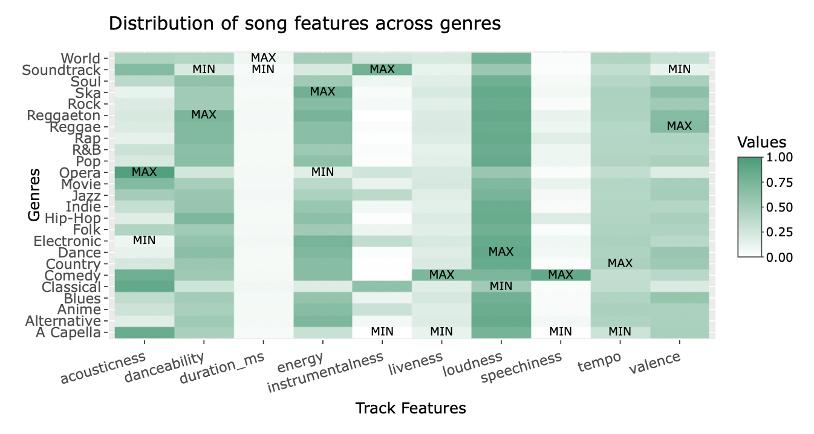

.. _Top:

Projects
========

Below are some extra-curricular projects I have worked on. These projects are not directly related to my research, but they are a testament to my ability to think creatively, learn new skills and apply them to real-world problems.

Research Projects
-----------------

Microbiome Diversity R Shiny App
""""""""""""""""""""""""""""""""

.. image:: ../Media/gifs/MicrobiomeRshinyApp.gif
   :target: https://michael-sieler.shinyapps.io/MicrobiomeDiversityShinyApp/
   :width: 50%

`Microbiome Diversity R Shiny App <https://michael-sieler.shinyapps.io/MicrobiomeDiversityShinyApp/>`_ is a proof-of-concept AI-powered interface that users can use to explore, analyze, and visualize microbiome data. 

Tools used:

- R (data analysis, visualization)
- RShiny (web application development)
- HuggingFace API (LLM)

Gut Microbiome Centered Framework
""""""""""""""""""""""""""""""""""

.. image:: ../../Media/presentations/OPHA_Poster2024.png
   :target: https://michaelsieler.com/en/latest/_images/OPHA_Poster2024.png
   :width: 50%
   :alt: OPHA 80th Annual Conference 2024 Poster

This poster a work in progress and an attempt to bridge public health and social equity issues by using what I'm calling a gut microbiome-centered framework. The gut microbiome (GMB)—a diverse community of microorganisms in the gastrointestinal tract—plays a crucial role in human health by aiding digestion, modulating the immune system, and protecting against pathogens. However, its composition and function are shaped by systemic, environmental, and individual factors, which can be exacerbated or mitigated by social determinants of health. A GMB-centered framework operates under the assumption that GMBs are a reflection of myriad influences an individual experiences at a given moment in time. The GMB-centered framework offers an ecological approach to help researchers, public health officials, and policymakers identify and address health disparities by asking the questions: "How is the GMB impacted by a particular issue? And, what factors contribute to this issue?". By considering these questions, the GMB-centered framework offers a holistic, ecological approach to understanding health disparities and guiding equitable public health interventions.

Tools used:

- Adobe Illustrator & Affinity Designer (graphic design)

Creative Projects
-----------------

GutMichaelBiome
"""""""""""""""

.. raw:: html

   <link rel="stylesheet" href="https://cdn.jsdelivr.net/npm/swiper/swiper-bundle.min.css"/>
   

       

           

           

           

           

           

           

       

       

       

       

   

   
   

`GutMichaelBiome <https://gutmichaelbio.me/>`_ is a play on words of "Gut Microbiome and Michael." To express my creativity and passion for sharing and communicating microbiome science through humor, I created a sticker-of-the-month club, where each month I send 20+ (and counting) members a new sticker that I designed based on a microbiome or microbiology-related topic. You can find more information about the club and how to join on the `GutMichaelBiome website <https://gutmichaelbio.me/>`_.

Virtual Fish
""""""""""""

.. image:: ../Media/gifs/VirtualFish-Demo.gif
   :target: https://github.com/OSU-Edu-Games/Virtual-Fish
   :width: 50%

`Virtual Fish <https://github.com/OSU-Edu-Games/Virtual-Fish>`_ (GitHub) is a science communication game developed in collaboration with `Dr. Stephen Atkinson <https://microbiology.oregonstate.edu/dr-stephen-atkinson>`_ (lab website) and Austin Hammer in the department of Microbiology at Oregon State University. Virtual Fish is a tamagotchi-like game where players take care of a fish by feeding it, cleaning its tank, and administering it medicine whenever it gets an infection.

Tools used:

- C#, Unity (software development)
- GitHub (version control, game hosting)

Spotify Genre Visualization
"""""""""""""""""""""""""""

`Spotify Genre Visualization <https://michael-sieler.shinyapps.io/Spotify_heatmap/>`_ is an interactive visualization of the Spotify dataset used in the Data Visualization course taught by Dr. Charlotte Wickham.

For the project, I chose a dataset derived from Spotify curated on Kaggle. The dataset contained data on a quarter million songs with over two dozen features per song. The data for these songs needed to be filtered and wrangled. After reducing the data set to a tenth its original size, I transformed and normalized the data to make an interactive heat map.

Tools used:

- Kaggle (data source)
- R (data wrangling, visualization)

------

Return to `top`_.

------
