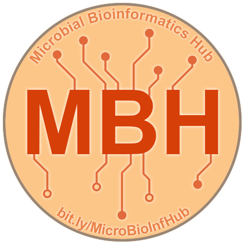

Projects
========

Virtual Fish
------------

.. image:: ../Media/gifs/VirtualFish-Demo.gif
   :target: https://github.com/OSU-Edu-Games/Virtual-Fish
   :width: 50%

In collaboration with `Dr. Stephen Atkinson <https://microbiology.oregonstate.edu/dr-stephen-atkinson>`_ (lab website) in the department of Microbiology at Oregon State University, I have been actively developing an educational game called `Virtual Fish <https://github.com/OSU-Edu-Games/Virtual-Fish>`_ (GitHub).

Virtual Fish is a tamagotchi-like game where players take care of a fish by feeding it, cleaning its tank, and administering it medicine whenever it gets an infection.

Tools used:

- C#, Unity (software development)
- GitHub (version control, game hosting)

Spotify Genre Visualization
---------------------------

.. image:: ../Media/images/SpotifyShinyApp.png
   :target: https://michael-sieler.shinyapps.io/Spotify_heatmap/
   :width: 50%

As part of a Data Visualization course taught by Dr. Charlotte Wickham (yes, that Wickham), we were tasked with making an interactive visualization based on a large dataset we found from database.

`For my project <https://michael-sieler.shinyapps.io/Spotify_heatmap/>`_ (RShiny app), I chose a dataset derived from Spotify curated on Kaggle. The dataset contained data on a quarter million songs with over two dozen features per song. The data for these songs needed to be filtered and wrangled. After reducing the data set to a tenth its original size, I transformed and normalized the data to make an interactive heat map.

Tools used:

- Kaggle (data source)
- R (data wrangling, visualization)

..
    Download: :download:`Script <../Media/scripts/R/placeholder.Rmd>`

Microbial Bioinformatics Hub
----------------------------

Microbial Bioinformatics Hub is an open-source, collaborative space for researchers and students to find, learn and share knowledge, methods and tools related to analyzing microbiological data. You can find the site `here <https://microbial-bioinformatics-hub.readthedocs.io/en/latest/index.html>`_.

Tools used:

- Sphinx and ReadTheDocs (website framework and hosting)
- Python, HTML and CSS (styling/formatting)

------
