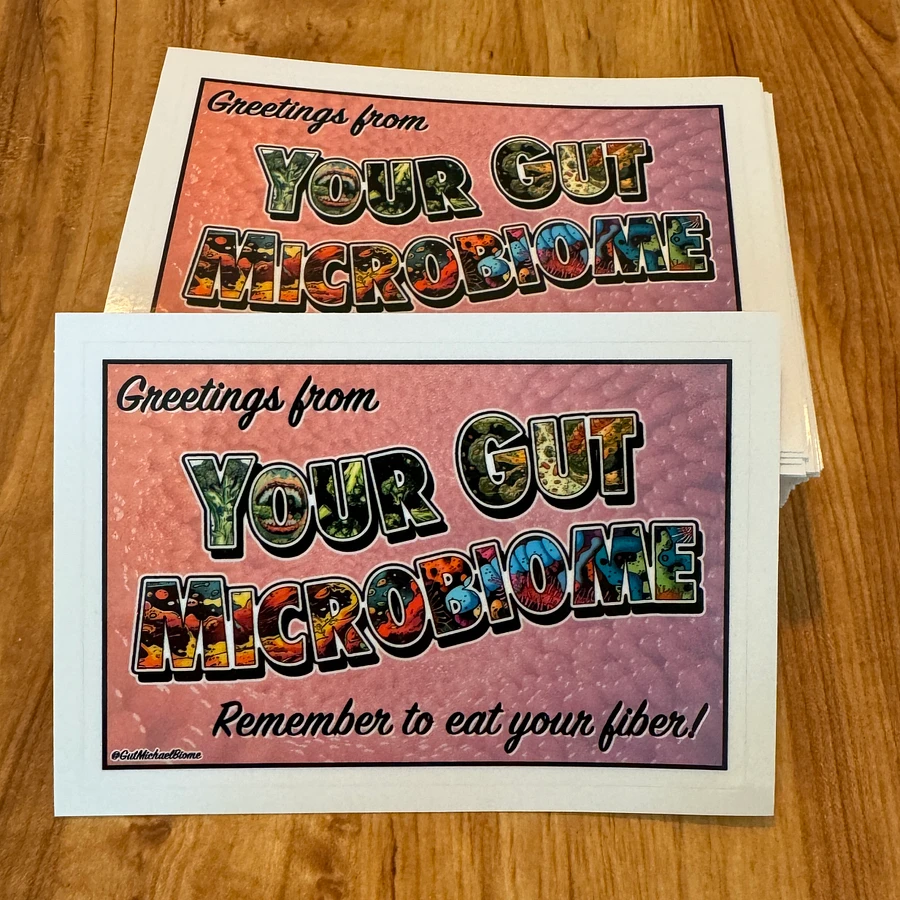

.. _Top:

Projects
========

Below are some extra-curricular projects I have worked on. These projects are not directly related to my research, but they are a testament to my ability to think creatively, learn new skills and apply them to real-world problems.

Research Projects
-----------------

Microbiome Diversity R Shiny App
""""""""""""""""""""""""""""""""

.. image:: ../Media/gifs/MicrobiomeRshinyApp.gif
   :target: https://michael-sieler.shinyapps.io/MicrobiomeDiversityShinyApp/
   :width: 50%

`Microbiome Diversity R Shiny App <https://michael-sieler.shinyapps.io/MicrobiomeDiversityShinyApp/>`_ is a proof-of-concept AI-powered interface that users can use to explore, analyze, and visualize microbiome data. 

Tools used:

- R (data analysis, visualization)
- RShiny (web application development)
- HuggingFace API (LLM)

Creative Projects
-----------------

GutMichaelBiome
"""""""""""""""

`GutMichaelBiome <https://gutmichaelbio.me/>`_ is a play on words of "Gut Microbiome and Michael." To express my creativity and passion for sharing and communicating microbiome science through humor, I created a sticker-of-the-month club, where each month I send 20+ (and counting) members a new sticker that I designed based on a microbiome or microbiology-related topic. You can find more information about the club and how to join on the `GutMichaelBiome website <https://gutmichaelbio.me/>`_.

Virtual Fish
""""""""""""

.. image:: ../Media/gifs/VirtualFish-Demo.gif
   :target: https://github.com/OSU-Edu-Games/Virtual-Fish
   :width: 50%

`Virtual Fish <https://github.com/OSU-Edu-Games/Virtual-Fish>`_ (GitHub) is a science communication game developed in collaboration with `Dr. Stephen Atkinson <https://microbiology.oregonstate.edu/dr-stephen-atkinson>`_ (lab website) and Austin Hammer in the department of Microbiology at Oregon State University. Virtual Fish is a tamagotchi-like game where players take care of a fish by feeding it, cleaning its tank, and administering it medicine whenever it gets an infection.

Tools used:

- C#, Unity (software development)
- GitHub (version control, game hosting)

Spotify Genre Visualization
"""""""""""""""""""""""""""

.. image:: ../Media/images/SpotifyShinyApp.png
   :target: https://michael-sieler.shinyapps.io/Spotify_heatmap/
   :width: 50%

As part of a Data Visualization course taught by Dr. Charlotte Wickham (yes, that Wickham), we were tasked with making an interactive visualization based on a large dataset we found from database.

`For my project <https://michael-sieler.shinyapps.io/Spotify_heatmap/>`_ (RShiny app), I chose a dataset derived from Spotify curated on Kaggle. The dataset contained data on a quarter million songs with over two dozen features per song. The data for these songs needed to be filtered and wrangled. After reducing the data set to a tenth its original size, I transformed and normalized the data to make an interactive heat map.

Tools used:

- Kaggle (data source)
- R (data wrangling, visualization)

..
    Download: :download:`Script <../Media/scripts/R/placeholder.Rmd>`

------

Return to `top`_.

------
