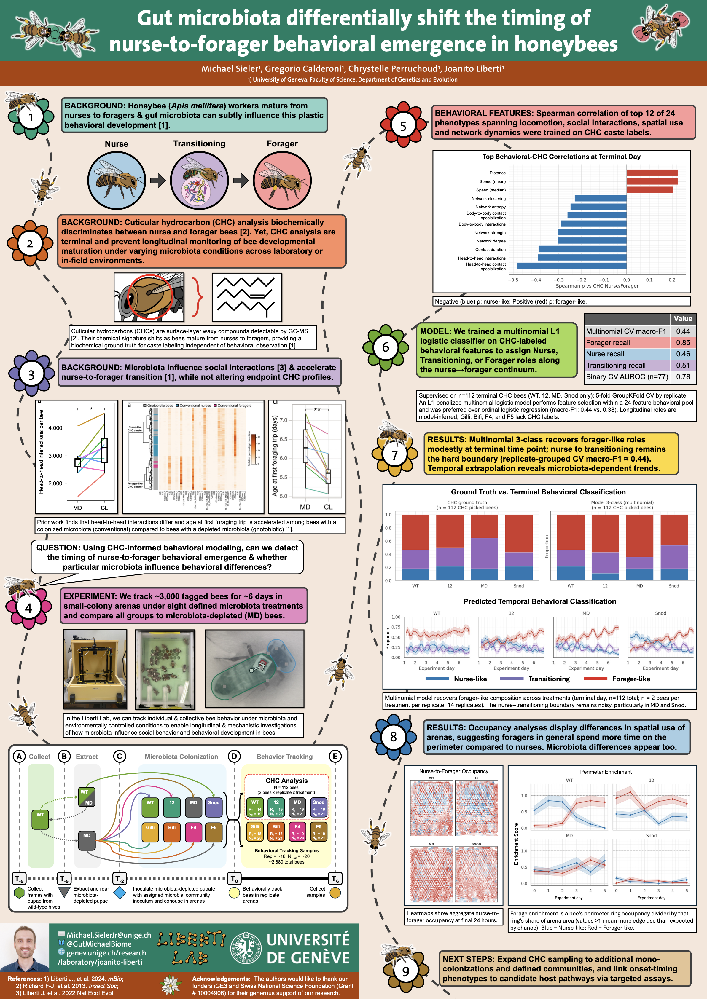

.. _Top:

IUSSI 2026
==========

Overview
--------

Honeybee workers shift from in-hive nursing to foraging as they age, and prior work from the Liberti Lab shows that gut microbiota can influence the timing of this transition. Cuticular hydrocarbon (CHC) profiles can distinguish nurses from foragers, but the assay is terminal, so it cannot track the same bee over time.

To follow behavioral emergence longitudinally, we tagged and tracked about 2,880 bees for roughly six days in small-colony arenas (20 arenas) under eight gut microbiota conditions, including microbiota-depleted bees. We then trained a classifier on CHC-labeled behavioral features (locomotion, social contacts, spatial use, and network structure) to assign nurse-like, transitioning, or forager-like roles along that continuum.

The model recovered forager-like bees reasonably well at the end of tracking, while nurse versus transitioning remained harder to separate. Applying the model across days suggested that microbiota composition shifts *when* forager-like behavior appears, not only the endpoint label. Forager-like bees also used the arena perimeter more than nurse-like bees, with additional microbiota-dependent differences in spatial use.

If you would like to learn more about this research, visit the `Liberti Lab website <https://genev.unige.ch/research/laboratory/joanito-liberti>`_.

Poster
------

Click on poster to enlarge. :download:`Download PDF <../../Media/presentations/IUSSI_Poster2026.pdf>`

Occupancy heatmaps
------------------

These heatmaps show where honeybees spend their time inside experimental arenas over about six days, compared across four gut-microbiota treatments (WT, 12, MD, and SNOD).

Each column is one treatment. Brighter patches mean more bees were there during that short time window. Bees are split into two behavioral types, trained to match chemical caste labels: nurse-like (blue; typically stay near the nest/brood area) and forager-like (red; more often toward the edges, where food is).

Reading down a column:

- **Occupancy** — all bees together
- **Aggregated** — nurses and foragers overlaid (blue vs red)
- **Nurse-like only**
- **Forager-like only**
- **Proportion over time** — how the nurse/forager mix changes day by day

The animation is a time-lapse of that spatial split. In plain terms: the colony does not mill about at random. Nurses and foragers tend to occupy different parts of the nest, and that pattern can be watched as it develops across treatments.

.. raw:: html

   <video class="media-block" autoplay muted loop playsinline controls
          aria-label="Time-lapse occupancy heatmaps across microbiota treatments">
     <source src="../../_static/videos/IUSSI_Poster2026_Heatmaps.mp4" type="video/mp4">
     Your browser does not support the video tag.
   </video>

------

Return to `top`_.

------
