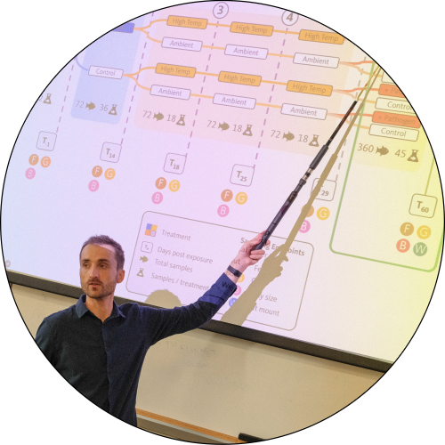
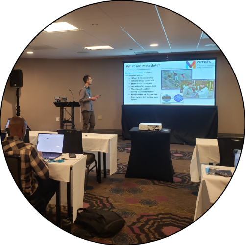

:orphan:

.. meta::
   :robots: noindex

.. _Top:

Publications
============

This is a test of automated publication sync from `OpenAlex <https://openalex.org/>`_ using ORCID `0000-0002-8332-3408 <https://orcid.org/0000-0002-8332-3408>`_. It is not linked from the site navigation. See the official `Publications <publications.html>`_ page for the curated list.

.. raw:: html

   

       

           

           

       

       

       

       

   

..
   Generated by scripts/sync_openalex_publications.py. Do not edit between the OPENALEX markers.

.. OPENALEX:START
Peer-Reviewed Publications
--------------------------

.. list-table::
   :widths: 90 10

   * - `"Modeling the zebrafish gut microbiome’s resistance and sensitivity to climate change and parasite infection" <https://doi.org/10.3389/frmbi.2025.1605168>`_ *Frontiers in Microbiomes* :download:`PDF <../Media/publications/Sieler2025_FrontMicrobiome.pdf>`

       - **Michael J. Sieler Jr.**, Colleen E. Al‐Samarrie, Kristin D. Kasschau, ML Kent, Thomas J. Sharpton
     - 2025
   * - `"Gut microbiota metabolically mediate intestinal helminth infection in zebrafish" <https://doi.org/10.1128/msystems.00545-24>`_ *mSystems* :download:`PDF <../Media/publications/Hammer2024_mSystems.pdf>`

       - Austin Hammer, Christopher A. Gaulke, Manuel García‐Jaramillo, Connor Leong, Jeffrey T. Morré, **Michael J. Sieler Jr.**, Jan F. Stevens, Yuan Jiang, Claudia S. Maier, Michael L. Kent, Thomas J. Sharpton
     - 2024
   * - `"The zebrafish gut microbiome influences benzo[a]pyrene developmental neurobehavioral toxicity" <https://doi.org/10.1038/s41598-024-65610-3>`_ *Scientific Reports* :download:`PDF <../Media/publications/Stagaman2024_NatureSciRep.pdf>`

       - Keaton Stagaman, Alexandra Alexiev, **Michael J. Sieler Jr.**, Austin Hammer, Kristin D. Kasschau, Lisa Truong, Robyn L. Tanguay, Thomas J. Sharpton
     - 2024
   * - `"Disentangling the link between zebrafish diet, gut microbiome succession, and Mycobacterium chelonae infection" <https://doi.org/10.1186/s42523-023-00254-8>`_ *Animal Microbiome* :download:`PDF <../Media/publications/Sieler2023_AnimMicrobiome.pdf>`

       - **Michael J. Sieler Jr.**, Colleen E. Al‐Samarrie, Kristin D. Kasschau, Zoltán M. Varga, Michael L. Kent, Thomas J. Sharpton
     - 2023
   * - `"Early enteric and hepatic responses to ingestion of polystyrene nanospheres from water in C57BL/6 mice" <https://doi.org/10.3389/frwa.2022.925781>`_ *Frontiers in Water* :download:`PDF <../Media/publications/Szule2022_FrontWater.pdf>`

       - Joseph A. Szule, Lawrence R. Curtis, Thomas J. Sharpton, Christiane V. Löhr, Susanne M. Brander, Stacey L. Harper, Jamie M. Pennington, Sara J. Hutton, **Michael J. Sieler Jr.**, Kristin D. Kasschau
     - 2022
   * - `"Revealing General Patterns of Microbiomes That Transcend Systems: Potential and Challenges of Deep Transfer Learning" <https://doi.org/10.1128/msystems.01058-21>`_ *mSystems* :download:`PDF <../Media/publications/David2022_mSystems.pdf>`

       - Maude M. David, Christine Tataru, Quintin Pope, L. Baker, Mary K. English, Hannah E. Epstein, Austin Hammer, Michael Kent, **Michael J. Sieler Jr.**, Ryan Mueller, Thomas J. Sharpton, Fiona Tomás, Rebecca Vega Thurber, Xiaoli Z. Fern
     - 2022
   * - `"Phylogenetic Integration Reveals the Zebrafish Core Microbiome and Its Sensitivity to Environmental Exposures" <https://doi.org/10.3390/toxics9010010>`_ *Toxics* :download:`PDF <../Media/publications/Sharpton2021_Toxics.pdf>`

       - Thomas J. Sharpton, Keaton Stagaman, **Michael J. Sieler Jr.**, Holly K. Arnold, Edward W. Davis
     - 2021

Preprints
---------

.. list-table::
   :widths: 90 10

   * - `"Historical contingency shapes zebrafish host-microbiome responses to a subsequent biotic challenge" <https://doi.org/10.64898/2026.07.05.734762>`_ *bioRxiv (Cold Spring Harbor Laboratory)* :download:`PDF <../Media/publications/Sieler2026_bioRxiv.pdf>`

       - **Michael J. Sieler Jr.**, Connor Leong, Kristin Kasschau, ML Kent, Thomas J. Sharpton
     - 2026
   * - `"The zebrafish gut microbiome influences benzo[a]pyrene developmental neurotoxicity" <https://doi.org/10.21203/rs.3.rs-3944268/v1>`_ *Research Square*

       - Keaton Stagaman, Alexandra Alexiev, **Michael J. Sieler Jr.**, Austin Hammer, Kristin D. Kasschau, Lisa Truong, Robyn L. Tanguay, Thomas J. Sharpton
     - 2024
   * - `"Common laboratory diets differentially influence zebrafish gut microbiome’s successional development and sensitivity to pathogen exposure" <https://doi.org/10.21203/rs.3.rs-2530939/v1>`_ *Research Square*

       - **Michael J. Sieler Jr.**, Colleen E. Al‐Samarrie, Kristin D. Kasschau, Zoltán Varga, Michael L. Kent, Thomas J. Sharpton
     - 2023

.. OPENALEX:END

In-prep Publications
--------------------

.. list-table::
   :widths: 90 10

   * - "Using fecal samples as a reliable proxy for bumblebee (*Bombus terrestris*) gut microbiota community analysis" (*in-prep*; *co-first authors*)

       - Gregorio Calderoni\*, **Michael J. Sieler Jr.**\*, Enrico Giammatteo, Chrystelle Perruchoud, Joanito Liberti
     - 2026*
   * - "System-Agnostic Dynamical Microbiome Measures (SADMMs) for longitudinal multi-study and -system microbiome analysis" (*in-prep*)

       - **Michael J. Sieler Jr.**, Connor Leong, Kristin D Kasschau, Thomas J Sharpton
     - 2026*
   * - "Investigating the interaction of host genetics and parasite burden on the microbiome in zebrafish" (*in-prep, draft available upon request*)

       - Emilee Lance, **Michael J. Sieler Jr.**, ...
     - 2025*
   * - "Analyzing batch effect correction algorithms for small molecule data using ground truth from a designed experiment" (*in-prep*)

       - Damon T. Leach, **Michael J. Sieler Jr.**, ...
     - 2025*

Presentations
-------------

.. list-table::
   :widths: 80 20

   * - "Defining the context dependence of how the zebrafish gut microbiome responds to environmental stressors." *Invited Seminar, Department of Genetics and Evolution, University of Geneva.*

       - **Michael J. Sieler Jr.**
     - 2025

       Geneva, Switzerland
   * - "Defining the context dependence of how the zebrafish gut microbiome responds to environmental stressors." *Invited Seminar, Institute of Molecular Biology, University of Oregon.*

       - **Michael J. Sieler Jr.**
     - 2025

       Eugene, OR
   * - `"Modelling the gut microbiome's resistance and resilience to climate change and infection in zebrafish." <https://sim.confex.com/sim/cmic2024/meetingapp.cgi/Paper/50975>`_ *Connecting Microbiome Communities.*

       - **Michael J. Sieler Jr.**, *et al.*
     - 2024

       San Diego, CA
   * - "Modelling the gut microbiome's resistance and resilience to climate change and infection in zebrafish." *Beneficial Microbes Conference.*

       - **Michael J. Sieler Jr.**, *et al.*
     - 2024

       Madison, WI
   * - "Choice of batch correction method is an important factor in small molecule study." *Metabolomics Association of North America.*

       - **Michael J. Sieler Jr.**, *et al.*
     - 2023

       Columbia, MO
   * - "Effects of diet on growth and the microbiome." *Aquaculture.* :download:`Slides <../Media/presentations/Aquaculture2022_MichaelSieler.pdf>`

       - **Michael J. Sieler Jr.**, *et al.*
     - 2022

       San Diego, CA
   * - "Zebrafish laboratory diets differentially alter gut microbiota composition." *3rd Intl. Fish Microbiota Workshop, Chinese Academy of Agriculture Sciences.* :download:`Slides <../Media/presentations/IFMW2021_MichaelSieler.pdf>`

       - **Michael J. Sieler Jr.**, et al.
     - 2021

       Beijing, China (*remote*)

Conference Posters
""""""""""""""""""

.. list-table::
   :widths: 80 20

   * - "Unraveling how gut microbiota influence nurse-to-forager behavioral emergence in honeybees." *XX International Congress of the International Union for the Study of Social Insects (IUSSI).* :icon:`fas fa-download` `Poster <../Publications/Presentations/IUSSI_Poster2026.html>`_

       - **Michael J. Sieler Jr.**, *et al.*
     - 2026

       Freiburg, Germany
   * - "Ecological, Developmental, and Social Determinants of Microbial Transmission in the Semelparous Eusocial Bee *Bombus terrestris*." *Biology26 Conference, University of Neuchâtel.*

       - **Michael J. Sieler Jr.**, *et al.*
     - 2026

       Neuchâtel, Switzerland
   * - "Modelling the Gut Microbiome's Resistance and Resilience to Climate Change and Infection in Zebrafish." *College of Science Graduate Science Research Showcase, Oregon State University.*

       - **Michael J. Sieler Jr.**, *et al.*
     - 2025

       Corvallis, OR
   * - "The human gut microbiome at the intersection of public health and social equity". *Oregon Public Health Association.* :icon:`fas fa-download` `Poster <../Publications/Presentations/OPHA_Poster2024.html>`_

       - **Michael J. Sieler Jr.**
     - 2024
     
       Corvallis, OR
   * - "How do external environmental factors impact the gut microbiome to influence host health?" *ARCS Foundation.* :icon:`fas fa-download` `Poster <../Publications/Presentations/ARCS_Poster2022.html>`_

       - **Michael J. Sieler Jr.**, *et al.*
     - 2022

       Portland, OR
   * - "The Gut Microbiome Drives Benzo[a]pyrene's Impact on Zebrafish Behavioral Development." *2nd Intl. Fish Microbiota Workshop, University of Oregon.*

       - **Michael J. Sieler Jr.**, *et al.*
     - 2019
     
       Eugene, OR
   * - "The Gut Microbiome Drives Benzo[a]pyrene's Impact on Zebrafish Behavioral Development." *CAS Student Showcase, Oregon State University.*

       - **Michael J. Sieler Jr.**, *et al.*
     - 2019

       Corvallis, OR

Conference Panels
""""""""""""""""""

.. list-table::
   :widths: 80 20

   * - "The Importance of Inclusive Practices in Microbiome Science." *Beneficial Microbes.*

       - Mónica Medina, Rosie Alegado, Ibrahim Zuniga-Chaves, Korin Jones, Jessamine Kuehn, **Michael J. Sieler Jr.**
     - 2024
     
       Madison, WI

Workshops
""""""""""

.. list-table::
   :widths: 80 20

   * - `"Microbiome Data Analytics Boot Camp: Planning, generating, and analyzing 16S rRNA gene sequencing surveys" <https://www.publichealth.columbia.edu/academics/non-degree-special-programs/professional-non-degree-programs/skills-health-research-professionals-sharp-training/trainings/microbiome>`_ *Columbia University (SHARP).*

       - **Michael J. Sieler Jr.**, *et al.*
     - 2025

       Virtual (*remote*)
   * - `"Microbiome Metadata Mastery and Research Training: Equipping the Next Generation of Researchers Across Academia, Government, and Industry" <https://sim.confex.com/sim/cmic2024/meetingapp.cgi/Session/5747>`_ *Connecting Microbiome Communities.*

       - **Michael J. Sieler Jr.**, *et al.*
       - Co-led workshop; prepared training and demonstration materials
     - 2024

       San Diego, CA
   * - "NMDC: Metadata Standards and Submission Portal for Multi-Omic Analysis" *Microbiology Department, Oregon State University.*

       - **Michael J. Sieler Jr.**
       - Led workshop; prepared training and demonstration materials
     - 2024

       Corvallis, OR
   * - "ASM professional development series for Oregon microbiologists: Careers in academia vs. industry" *American Society for Microbiology.*

       - **Michael J. Sieler Jr.**, *et al.*
     - 2024

       Corvallis, OR

Other
-----

Ph.D. Dissertation
"""""""""""""""""""

.. list-table::
   :widths: 90 10

   * - `"Defining the context dependence of how the zebrafish (*Danio rerio*) gut microbiome responds to environmental stressors" <https://ir.library.oregonstate.edu/concern/graduate_thesis_or_dissertations/d217r0126>`_ *Oregon State University.* :download:`PDF <../Media/publications/SielerJrMichaelJ2025.pdf>`

       - **Michael J. Sieler Jr.**
     - 2025

Undergraduate Thesis
""""""""""""""""""""

.. list-table::
   :widths: 90 10

   * - `"The Gut Microbiome Drives Benzo[a]pyrene's Impact on Zebrafish Behavioral Development." <https://bit.ly/3v3VndE>`_ *Oregon State University.* :download:`PDF <../Media/publications/Sieler2020_OSUthesis.pdf>`

       - **Michael J. Sieler Jr.**, ... 
     - 2020

------

.. OPENALEX-SYNC:START
*Last synced from OpenAlex: 2026-08-13 14:18 UTC.*
.. OPENALEX-SYNC:END

------

Return to `top`_.

------
