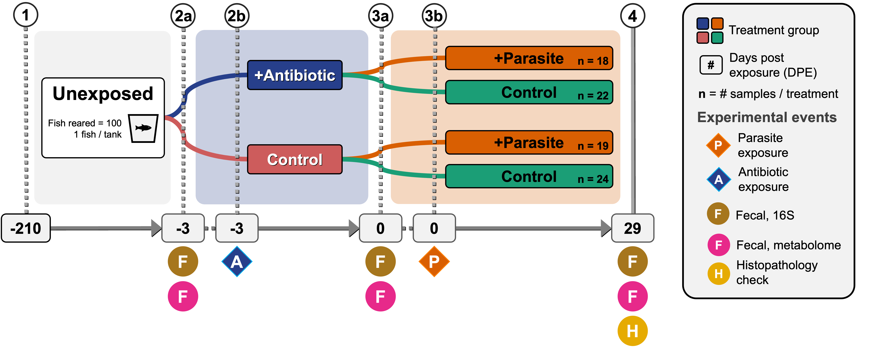
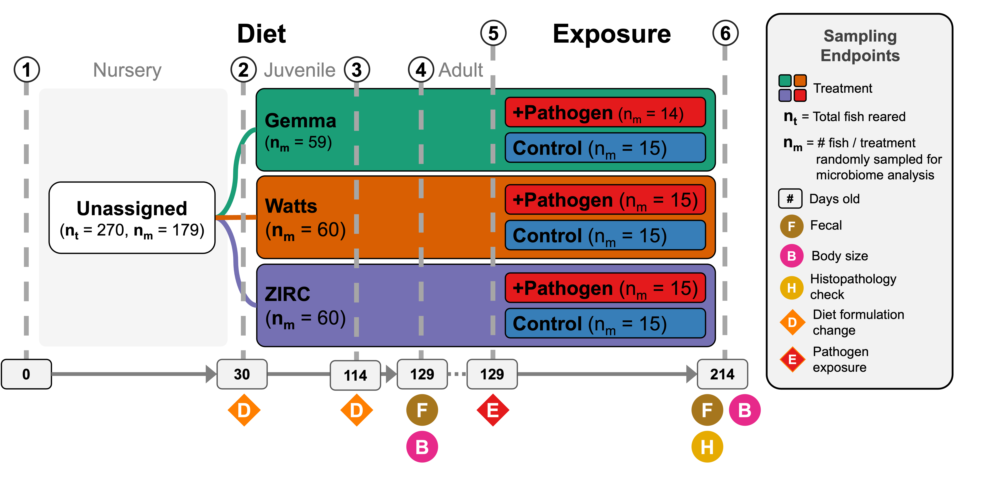

.. _Top:

Services
========

I offer expert data science and life sciences solutions, specializing in coding, statistics, research, experimental design, and analysis. I have a strong background in microbiome bioinformatics, and I am experienced in working with and integrating large, multi-omic datasets. I am also a skilled communicator and can help you present your findings in a clear and compelling way. Below you can find examples of my work and the skills I can offer.

Figure design
-------------

Microbiome research experiments can be complicated involving multiple and combined treatment groups, longitidunal sampling, and multi-omic data. Taking inspiration from subway maps, I have designed figures to clearly and effectively communicate complex experimental designs and results. Below are some examples of figures I have designed for my research.

`Figure 1: Hammer et al. 2024. mSystems. Experimental Design Schematic <https://journals.asm.org/doi/10.1128/msystems.00545-24>`_

`Figure 1: Sieler et al. 2023. mSystems. Experimental Design Schematic <https://rdcu.be/djX1r>`_

Microbiome Bioinformatic Analysis
---------------------------------

I have experience analyzing multivariate longitudinal microbiome data across a variety of systems (human, mice, zebrafish). I can assist you from processing your raw data, to developing bioinformatic workflows, and interpreting your results. Below are some examples of my work:

- `Effects of multiple and combined environmental stressors on the zebrafish gut microbiome. <https://sielerjm.github.io/Sieler2024__ZF_Temperature_Parasite/Results_Overview.html>`_
- `My GitHub <https://www.linkedin.com/in/mjsielerjr/>`_

Scientific Writing and Editing:
-------------------------------

I have experience writing and editing scientific manuscripts. I can help you with your writing needs, from drafting your first manuscript to polishing your final draft. Below are some examples of my work:

- `Disentangling the link between zebrafish diet, gut microbiome succession, and Mycobacterium chelonae infection. Sieler *et. al. Animal Microbiome* (2023) <https://rdcu.be/djX1r>`_

Additionally, I offer free writing resources that I've acquired from my own experience and lessons from my scientific mentors on my `blog <https://blog.michaelsieler.com/en/latest/posts/scientificwritingresources.html>`_.

------

Return to `top`_.

------
