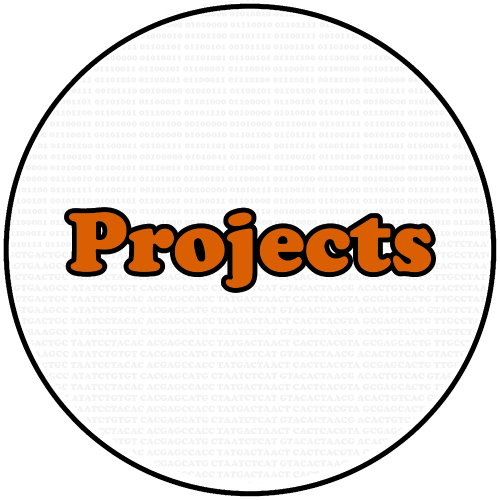

.. include:: rstStyles.rst

..title:: Michael Sieler
	 :white:

.. image:: Media/images/Sofie-I-Coast-2022-500px.png
   :target: AboutMe.html
   :align: center
   :alt: Photo of Michael
   :width: 30%

------

Welcome! My name is Michael Sieler. I'm a 3rd year PhD Student in the department of Microbiology at Oregon State University. The goal of this site is to provide a central space to share my `research and work experience <https://michaelsieler.com/en/latest/Experience/experience.html>`_, `projects <https://michaelsieler.com/en/latest/Projects/projects.html>`_ and `blog <https://blog.michaelsieler.com/>`_. Have a look around and don't hesitate to `reach out <sielerjm@oregonstate.edu>`_ to me if you'd like to collaborate on a project!

.. image:: Media/images/Research.png
   :target: Experience/experience.html
   :width: 30%

.. toctree::
   :maxdepth: 1

   AboutMe
   Experience/experience
   Publications/publications
   Projects/projects
   Blog <https://blog.michaelsieler.com/>

.. toctree::
   :hidden:
   :Caption: My Links

   GitHub <https://github.com/sielerjm>
   LinkedIn <https://www.linkedin.com/in/mjsielerjr/>

..
   _More info on styling sphinx: https://sphinx-rtd-theme.readthedocs.io/en/stable/demo/structure.html

------
