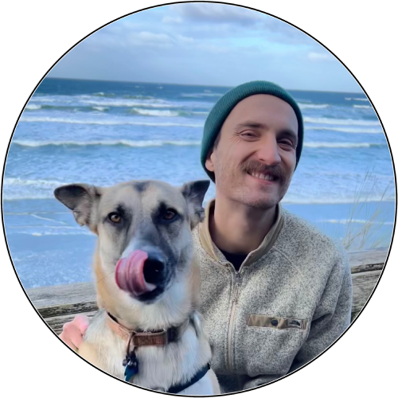

########
Welcome!
########

------

My name is Michael Sieler. I'm a microbiome data scientist. I'm in my final year as a PhD Candidate in the Sharpton Lab in the department of Microbiology at Oregon State University. I'm looking for bioinformatics-based `postdoctoral positions <https://michaelsieler.com/en/latest/Career/postdoc.html>`_ starting in Fall 2025.

The purpose of this site is to provide a central space to share my `research <https://michaelsieler.com/en/latest/Publications/publications.html>`_ and `work <https://michaelsieler.com/en/latest/Experience/experience.html>`_ experience, and `projects <https://michaelsieler.com/en/latest/Projects/projects.html>`_. 

Have a look around and don't hesitate to `reach out <mailto:sielerjm@oregonstate.edu>`_ to me if you'd like to collaborate on a project!

------

.. toctree::
   :hidden:
   :maxdepth: 1

   AboutMe
   Experience/experience
   Publications/publications
   Projects/projects
   Career/postdoc

------

Here's a brief (5 min) overview of my research:
* Recorded in 2024 for a fish ecology course to introduce my research to my classmates

.. raw:: html

    

        <iframe src="https://www.youtube.com/embed/YtPdUi3EbFA?si=Q2R8uc8EUQx5ASeT" title="YouTube video player" frameborder="0" allow="accelerometer; autoplay; clipboard-write; encrypted-media; gyroscope; picture-in-picture; web-share" referrerpolicy="strict-origin-when-cross-origin" allowfullscreen></iframe>
    

..
   _More info on styling sphinx: https://sphinx-rtd-theme.readthedocs.io/en/stable/demo/structure.html

.. toctree::
   :hidden:
   :Caption: My Links

   Scholar <https://scholar.google.com/citations?user=XqblXigAAAAJ>
   GitHub <https://github.com/sielerjm>
   LinkedIn <https://www.linkedin.com/in/mjsielerjr/>
